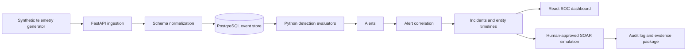
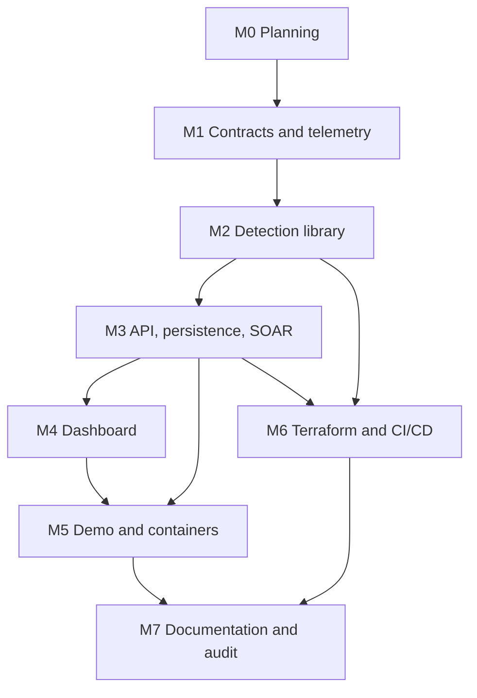

# SentinelForge implementation plan

## Mission

SentinelForge is a local-first, production-style Microsoft Sentinel detection-engineering and automated incident-response lab. It demonstrates the complete defensive workflow from synthetic telemetry through normalization, analytics, alert correlation, investigation, and explicitly human-approved SOAR simulation. Microsoft Sentinel KQL remains the authoritative cloud detection content; the Python evaluator implements only the documented behavior required for local demonstrations and tests.

## Non-negotiable boundaries

- Only deterministic or seeded synthetic telemetry is stored or rendered.
- Network addresses use RFC 5737, RFC 3849, RFC 1918, or loopback ranges as appropriate.
- Identities, tenants, organizations, hashes, cases, and screenshots are fictional.
- No exploit, password-guessing, credential theft, real containment, cloud mutation, or paid-resource creation is implemented.
- Every simulated containment request requires explicit local approval, produces an audit record, and changes only SentinelForge's local state.
- Secrets are read from the environment, never committed, and documented in `.env.example`.
- Terraform is formatted and validated only; `terraform apply` is outside project commands and CI.
- KQL is never represented as being executed locally. Python detection evaluators are behavioral counterparts with narrower, documented semantics.

## Target architecture

### Azure mapping

| Local component | Azure / Microsoft equivalent |
|---|---|
| Synthetic event generator | Lab data sources and ingestion test harness |
| FastAPI ingestion and normalization | Data Collection Rules, ASIM normalization, connector ingestion |
| PostgreSQL event store | Log Analytics workspace tables |
| Python evaluator | Microsoft Sentinel scheduled analytics rules written in KQL |
| Correlation service | Sentinel incident grouping and Microsoft Defender XDR correlation |
| Incident and entity APIs | Sentinel incidents, entities, and Defender XDR incidents |
| Local approved playbooks | Sentinel automation rules and Azure Logic Apps playbooks |
| React dashboard | Sentinel workbooks, hunting, incident queue, and custom SOC views |

## Architecture decisions

### AD-001 — Monorepo with independently testable applications

The repository contains `apps/api` and `apps/dashboard`, while portable detection content, schemas, generators, Terraform, playbooks, scripts, and documentation remain at the repository root. This keeps cloud content reviewable without requiring the application runtime.

### AD-002 — Detection packs are file-backed and contract-driven

Each rule is a directory containing metadata YAML, KQL, optional Sigma, positive and negative JSON fixtures, and expected alert JSON. A Python registry binds the stable rule ID to its evaluator. JSON Schema and tests enforce metadata, fixture, and result contracts.

### AD-003 — KQL is authoritative; Python is an explicit local counterpart

KQL examples target Sentinel or Defender tables and document their assumptions. The local evaluator does not parse KQL. It applies purpose-built Python predicates and aggregation windows to normalized synthetic events. Rule documentation identifies any semantic differences.

### AD-004 — PostgreSQL in containers, SQLite only for fast test isolation

The runtime uses PostgreSQL 16 through SQLAlchemy. Unit and most integration tests use SQLite in-memory through the same repository interfaces; a container-backed PostgreSQL smoke test verifies dialect compatibility when Docker is available.

### AD-005 — Explainable detections and conservative correlation

Every alert carries the rule ID, evidence event IDs, matched entities, MITRE mappings, detection timestamp, source time window, and a deterministic summary. Alerts correlate into incidents by scenario correlation ID first, then by overlapping high-confidence entities and a bounded time window. The implementation avoids opaque scoring.

### AD-006 — Safe SOAR state machine

Playbooks can enrich fictional indicators, add context, recommend actions, notify a local audit sink, change local incident workflow state, and export evidence. A requested containment action enters `pending_approval`; an analyst must approve it, and execution records `simulated_completed`. No adapter exists for real Entra, Defender, endpoint, firewall, email, Teams, or ServiceNow mutations.

### AD-007 — API-owned state and a typed frontend client

FastAPI publishes an OpenAPI contract. The React dashboard uses a small typed client and TanStack Query for server state. Accessible semantic controls, responsive layouts, and charts with textual equivalents are required.

### AD-008 — Reproducible demo scenarios

Generators use fixed seeds and named scenarios so CI and recruiter demos produce the same alert and incident set. `make demo` resets only the configured local SentinelForge database after an explicit environment guard.

### AD-009 — Detection-as-code gates

CI blocks changes when rule contracts, positive/negative fixtures, KQL structure, Sigma validation, MITRE formatting, type checks, tests, builds, secret scans, or Terraform formatting fail. Validation outputs a machine-readable quality snapshot consumed by the dashboard.

## Milestones

### Milestone 0 — Planning and governance

**Dependencies:** none.

**Deliverables**

- `PLANS.md` with milestones, decisions, risks, dependencies, and acceptance criteria.
- `AGENTS.md` with working agreements and security guardrails.
- Initial architecture presentation before application implementation.

**Acceptance criteria**

- Repository boundaries and local-versus-Azure behavior are explicit.
- Every definition-of-done requirement is assigned to a milestone.
- No implementation work precedes the architecture presentation.

### Milestone 1 — Foundation, contracts, and synthetic telemetry

**Dependencies:** Milestone 0.

**Deliverables**

- Python 3.12 project configuration, locked/declared dependencies, Ruff, MyPy, and Pytest configuration.
- Pydantic normalized-event, alert, incident, entity, audit, and detection metadata models.
- JSON Schemas for detection metadata, normalized events, expected alerts, and Sigma validation profile.
- Seeded generators covering all requested source families with documentation-safe identities and addresses.
- Unit tests for normalization, schema safety, deterministic generation, and forbidden-data checks.

**Acceptance criteria**

- Each requested telemetry source produces valid normalized events with raw references and correlations.
- A repository scan finds no named prohibited organizations, credentials, or public routable sample IPs.
- `pytest`, Ruff, and MyPy pass for the milestone surface.

### Milestone 2 — Detection library and quality engine

**Dependencies:** Milestone 1 event and rule contracts.

**Deliverables**

- Twelve detection packs with unique IDs, complete metadata, KQL, evaluators, fixtures, expected alerts, versions, and changelogs.
- At least six Sigma equivalents; Sigma is supplied where the event model maps honestly.
- Detection registry and batch evaluation service.
- Rule-quality report generator containing pass counts, coverage, severity distribution, data sources, tuning state, and validation time.
- Tests for positive/negative behavior, uniqueness, required fields, MITRE formatting, KQL structure, Sigma schema, and regression snapshots.

**Acceptance criteria**

- All 12 malicious fixtures trigger exactly the intended rule output.
- All 12 benign fixtures do not trigger their paired rule.
- No rule lacks investigation guidance, false positives, containment recommendations, mappings, version, or changelog.
- Quality report is generated from actual validation results, not hard-coded values.

### Milestone 3 — API, persistence, incident correlation, and SOAR

**Dependencies:** Milestone 2 detection registry.

**Deliverables**

- FastAPI ingestion, events, alerts, incidents, detections, hunts, ATT&CK, quality, playbook, notes, approvals, and health endpoints.
- SQLAlchemy 2 models and Alembic migrations for PostgreSQL.
- Alert correlation, incident assignment/status flows, entity timelines, evidence, and notes.
- Five safe local playbooks with approval controls and immutable audit records.
- Deterministic IOC enrichment and evidence-package export.
- Unit and API integration tests, including forbidden real-containment assertions.

**Acceptance criteria**

- Ingestion to incident creation works through public API/service boundaries.
- Filters, assignment, status, notes, timeline, evidence, and playbook audit endpoints are tested.
- Containment-like actions cannot run before approval and can only update local records.
- Health checks distinguish API readiness from database readiness.

### Milestone 4 — SOC dashboard

**Dependencies:** Milestone 3 API contract.

**Deliverables**

- React, TypeScript, and Vite application with seven requested pages.
- Dark, responsive SOC visual system; skip links, focus states, accessible names, contrast-safe tokens, keyboard-operable tables and dialogs.
- Operational charts backed by API data and paired with textual summaries.
- Incident approval and notes interactions connected to working API endpoints.
- Frontend unit/component tests and production build.

**Acceptance criteria**

- Every requested page has functioning data, filters, navigation, loading, empty, and error states.
- No dead or decorative control appears interactive.
- KQL/Sigma previews are escaped and read-only.
- Desktop and narrow viewport layouts are usable; browser QA confirms critical paths.

### Milestone 5 — Demo, containers, and operator commands

**Dependencies:** Milestones 3 and 4.

**Deliverables**

- Multi-stage API and dashboard Dockerfiles, Compose services, health checks, persistent database volume, and sample configuration.
- `Makefile` plus PowerShell equivalents for Windows.
- Safe `setup`, `demo`, `test`, `lint`, `validate`, and reset commands.
- End-to-end demo runner that seeds benign activity, injects named scenarios, evaluates, correlates, prints the dashboard URL, and lists expected incidents.

**Acceptance criteria**

- `docker compose up --build` reaches healthy services.
- `make demo` is idempotent and refuses unsafe or non-demo database targets.
- The generated incidents are visible through API and dashboard.
- Container build and end-to-end smoke tests pass.

### Milestone 6 — Azure artifacts, Terraform, and CI/CD

**Dependencies:** Milestone 2 cloud detection content and Milestone 3 playbook contracts.

**Deliverables**

- Terraform root and modules for resource group, Log Analytics, Sentinel onboarding, supported connectors, analytics rules, automation rules, watchlist alternative, and workbook artifact.
- Variables, outputs, example tfvars, cost/resource notes, provider limitations, and explicit no-apply guidance.
- Five Logic Apps workflow templates or honest pseudodeployment artifacts mapped to Sentinel, Defender XDR, Entra ID, ServiceNow, email, and Teams.
- GitHub Actions for backend, detections, frontend, Terraform, secret scanning, and Docker build verification.

**Acceptance criteria**

- `terraform fmt -check` and `terraform validate` pass when Terraform is available; otherwise the tooling limitation and static checks are recorded.
- CI workflow YAML parses and uses least-privilege read permissions unless a job requires more.
- No deployment, cloud mutation, or credentials are required for validation.

### Milestone 7 — Documentation, case studies, screenshots, and final audit

**Dependencies:** all implementation milestones.

**Deliverables**

- Recruiter-ready README, architecture documents, operations guide, security/privacy guide, Azure mapping, tuning guide, and recruiter guide.
- Three complete incident case studies grounded in actual demo output.
- Screenshots captured from the running dashboard at desktop and responsive sizes.
- Link checker, forbidden-content scan, clean-environment quick-start test, and final limitation review.
- Final report with architecture, exact commands, validation results, implemented detections, limitations, screenshot recommendations, resume bullets, and a 90-second demo script.

**Acceptance criteria**

- README claims are traceable to implemented and tested behavior.
- All links resolve and screenshots come from running functionality.
- Case-study timestamps, entities, alerts, and evidence match generated scenarios.
- The full definition of done is checked with evidence or an honest limitation.

## Dependency graph

## Verification strategy

| Layer | Verification |
|---|---|
| Contracts | Pydantic validation, JSON Schema tests, forbidden-value/property tests |
| Detection behavior | Positive/negative fixtures, expected-alert snapshots, window-boundary tests |
| KQL | Non-empty, expected table/reference, time filter, projection/entity checks, balanced delimiters |
| Sigma | `pySigma` parsing where compatible plus repository schema/profile validation |
| API | Service unit tests, FastAPI integration tests, database transaction tests |
| UI | ESLint, TypeScript, Vitest, Testing Library, production build, targeted browser walkthrough |
| Containers | Image builds, Compose config, service health, end-to-end demo smoke |
| Terraform | `fmt -check`, `init -backend=false`, `validate`, static no-apply/no-secret scan |
| Documentation | Markdown links, command smoke tests, screenshot provenance, claim audit |

## Risks and mitigations

| Risk | Impact | Mitigation |
|---|---|---|
| Local evaluator is mistaken for KQL execution | Misleading portfolio claim | Prominent limitation in README, UI, rule docs, and architecture; never parse or execute KQL locally |
| Azure provider lacks a requested connector or Sentinel object | Incomplete or brittle IaC | Use supported `azurerm`/`azapi` resources selectively; document unsupported resources and provide versioned deployment artifacts rather than false claims |
| Docker or Terraform is unavailable in the environment | Some validation cannot run | Run all available static and native tests; record exact skipped validation and commands for the user |
| Twelve rules create duplicated or superficial logic | Weak engineering signal | Give each rule source-specific fixtures, purpose-built evaluation, evidence, thresholds, false positives, and test boundaries |
| Correlation over-groups alerts | Misleading incidents | Prefer explicit synthetic correlation IDs; use bounded fallback correlation and expose its reasons |
| Synthetic telemetry accidentally resembles sensitive data | Privacy concern | Central safe-data factories, documentation ranges, fictional domains, prohibited-term scan, and tests |
| Demo reset targets a non-demo database | Data loss | Allowlisted database name/host, `SENTINELFORGE_DEMO_MODE` guard, transaction-scoped reset, clear logging |
| Charts obscure rather than inform | Poor SOC UX | Only chart time, severity, latency, and ATT&CK coverage; provide tables/text equivalents |
| Generated screenshots diverge from functionality | Credibility loss | Capture only after end-to-end demo data exists and validate critical interactions first |
| Dependency or secret scanning causes noisy CI | Maintenance burden | Pin major versions, use minimal dependencies, baseline only demonstrably false positives, fail on new findings |

## Definition-of-done evidence ledger

The final self-review will record each requirement as `pass`, `pass with limitation`, or `blocked`, with the validating command or artifact. A milestone is not marked complete until its acceptance criteria pass, and failed checks are fixed before moving forward unless the failure is caused by unavailable external tooling and is documented.

## Change hygiene

Changes are grouped by milestone. No commit is created unless requested, but the working tree is kept in logical, reviewable slices. Generated artifacts are reproducible; caches, databases, secrets, coverage data, and build output are ignored.

## Current implementation audit

Milestones 0–6 are implemented. Docker build, health, migration, demo, API, frontend, content, secret, and Terraform validation now pass. Milestone 7 remains open only for browser-based visual QA and real screenshot capture because the Windows browser runtime cannot initialize its workspace ACLs. The evidence is maintained in [docs/recruiter-guide/final-validation.md](docs/recruiter-guide/final-validation.md); strict screenshot completion is not claimed.

## Expansion milestones: threat intelligence, analytics, and ATT&CK v19.1

### Milestone 8 - connector security boundary and persistence (implemented)

- Environment-only SecretStr settings, global opt-in, strict observable normalization, SSRF-safe
  fixed endpoints, external-disclosure guards, TTL caching, incident linking, and audit history.
- Acceptance evidence: Ruff, strict MyPy, and API/unit tests cover validation, cache behavior,
  disabled live access, and deterministic local enrichment.

### Milestone 9 - read-only reputation providers (implemented)

- VirusTotal API v3 domain/IP reports, AbuseIPDB API v2 IP checks, GreyNoise Community IP context,
  and a deterministic local connector.
- No scan submission, sandbox upload, URL fetching, credential test, or containment adapter exists.
- Provider parsing is tested with httpx.MockTransport; tests make no internet calls.

### Milestone 10 - analyst reputation workflow (implemented)

- Threat Intelligence dashboard page, provider health/privacy status, explicit provider selection,
  lookup results, risk context, cache/history table, and incident-to-observable pivot.
- Live providers remain disabled in the committed/default configuration.

### Milestone 11 - SOC operational analytics (implemented)

- API and dashboard metrics for daily events/alerts/incidents, source/result mix, per-rule yield and
  mean latency, correlation ratio, incident state, and transparent entity-risk ranking.
- Scores are explainable local prioritization aids and are not described as ML predictions.

### Milestone 12 - MITRE ATT&CK versioning and export (implemented)

- Pinned Enterprise ATT&CK v19.1 metadata, 15-tactic matrix, TA0005 Stealth migration, TA0112
  Defense Impairment gap, validation/data-source relationships, limitations, and Navigator layer.
- Coverage means mapped and fixture-tested; it does not claim production efficacy.

### Milestone 13 - expanded validation and documentation (in progress)

- Backend, detection, frontend lint/test/type/build validation is passing for the expansion.
- Docker rebuild/health/demo, repository validation, link, secret, prohibited-data, API, IaC, and frontend gates pass.
- Remaining gate: browser walkthrough and real screenshots, blocked by the Windows browser-runtime ACL failure.

### Milestone 14 - repository and runtime security hardening (implemented)

- Docker-published API/dashboard ports are loopback-only; application containers are read-only,
  drop Linux capabilities, prevent privilege escalation, and use bounded temporary filesystems.
- Explicit trusted-host and CORS validation, API security headers, dashboard browser headers,
  request-size limits, bounded ingestion batches, and runtime concurrency limits are enforced.
- Local setup generates a cryptographically random ignored database password without overwriting
  an existing configuration.
- GitHub Actions use immutable commit SHAs, least-privilege permissions, timeouts, and concurrency
  cancellation. CodeQL, dependency review, Gitleaks, production dependency audits, Trivy image
  scans, Dependabot, CODEOWNERS, and security regression tests are present.
- Acceptance evidence: focused security tests, the full Python suite, Ruff, strict MyPy, frontend
  dependency audit/lint/tests/build, production Python dependency audit, workflow pinning tests,
  and repository safety checks pass. Docker/Trivy and Terraform runtime validation remain CI gates
  when local Docker Desktop or Terraform CLI is unavailable.
