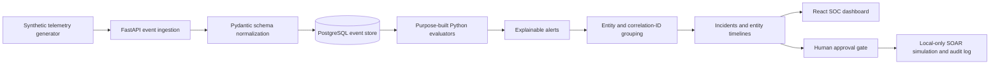

# SentinelForge

**Microsoft Sentinel Detection Engineering & Automated Incident Response Lab** — a local-first, recruiter-ready SIEM/SOAR portfolio that turns synthetic multi-cloud telemetry into tested detections, correlated incidents, entity timelines, and human-approved response simulations.


> This is a defensive training lab, not a professional production deployment. It uses fictional identities, deterministic synthetic security telemetry, and documentation-safe networks. It never performs real containment or cloud changes.

## Live dashboard

Run the Docker demo, then open the working [SOC Overview](http://localhost:5173),
[Incident Queue](http://localhost:5173/incidents),
[Threat Intelligence](http://localhost:5173/threat-intelligence), and
[SOC Analytics](http://localhost:5173/analytics). The repository does not include designed or
mocked screenshots; publishable captures must come from this running application and follow the
[screenshot provenance guide](docs/screenshots/README.md).
## Architecture



KQL files are authoritative Microsoft Sentinel analytics-rule examples. The local Python modules reproduce only the named detection behavior for deterministic testing; **SentinelForge does not parse or execute the complete KQL language**. See the [architecture and Azure mapping](docs/architecture/architecture.md).

## What the lab demonstrates

- Microsoft Sentinel and Defender XDR-oriented KQL detection engineering with versioned analytics rules.
- SIEM ingestion, log normalization, alert correlation, incident response, entity timelines, and threat hunting.
- Microsoft Entra ID, endpoint, Windows, firewall, Microsoft 365, Azure, AWS CloudTrail, and GuardDuty-shaped telemetry.
- MITRE ATT&CK v19.1 metadata, Sigma rules, positive/negative fixtures, Navigator export, and detection-as-code quality gates.
- Read-only VirusTotal, AbuseIPDB, and GreyNoise reputation connectors with local fallback, cache/history, privacy guards, and analyst attribution.
- SOC data analysis for ingestion mix, rule yield, correlation ratio, daily activity, and explainable entity-risk prioritization.
- FastAPI, SQLAlchemy, PostgreSQL, Pydantic, Python, Pytest, Ruff, and strict MyPy.
- React, TypeScript, Vite, TanStack Query, responsive accessibility, operational charts, and working analyst controls.
- Approval-gated local SOAR for identity investigation, unauthorized tools, IOC enrichment, notifications, and evidence packaging.
- Azure Logic Apps mapping artifacts for Microsoft Sentinel, Defender XDR, Microsoft Entra ID, ServiceNow, email, and Microsoft Teams.
- Terraform modules for Azure security resources plus GitHub Actions CI/CD, secret scanning, and container builds.

## Detection catalogue

| ID | Detection | Severity | Data source | MITRE ATT&CK | Sigma |
| --- | --- | --- | --- | --- | --- |
| SF-001 | Password spray across multiple accounts | High | SigninLogs | T1110.003 | — |
| SF-002 | Repeated failed authentication followed by success | High | SigninLogs | T1110, T1078.004 | — |
| SF-003 | Impossible travel / anomalous geographic sign-in | High | SigninLogs | T1078.004 | — |
| SF-004 | MFA fatigue followed by approval | High | SigninLogs | T1621 | — |
| SF-005 | Encoded or suspicious PowerShell | High | DeviceProcessEvents | T1059.001, T1027 | Yes |
| SF-006 | LSASS credential-access behavior | Critical | DeviceProcessEvents | T1003.001 | Yes |
| SF-007 | DCSync-related replication activity | Critical | SecurityEvent | T1003.006 | Yes |
| SF-008 | RDP-based lateral movement | High | DeviceLogonEvents | T1021.001 | Yes* |
| SF-009 | Unauthorized AnyDesk or TeamViewer | High | DeviceProcessEvents | T1219.002 | Yes |
| SF-010 | DNS tunnelling indicators | Medium | DeviceNetworkEvents | T1071.004 | Yes* |
| SF-011 | AWS IAM anomalous API activity | High | AWS CloudTrail | T1098.001, T1098 | Yes |
| SF-012 | Palo Alto-style outbound beaconing | Medium | CommonSecurityLog | T1071.001 | — |

`*` The Sigma form represents portable constituent-event selection; the KQL/Python forms perform the aggregation. Every rule includes metadata, entity mappings, known false positives, investigation and containment guidance, positive and negative fixtures, expected output, version, and changelog.

The current library maps seven of the 15 Enterprise ATT&CK v19.1 tactics and 14 unique techniques/sub-techniques. The [ATT&CK Coverage page](http://localhost:5173/attack-coverage) marks uncovered tactics as gaps, shows telemetry/validation relationships, and exports a Navigator-compatible layer instead of implying full defensive coverage.

## Quick start with Docker Compose

Prerequisites: Docker Desktop or Docker Engine with Compose v2. No Azure account is required.

```powershell
Copy-Item .env.example .env
docker compose up --build -d
docker compose exec api python -m scripts.demo
```

Open [http://localhost:5173](http://localhost:5173). Use [Threat Intelligence](http://localhost:5173/threat-intelligence) for IP/domain reputation and [SOC Analytics](http://localhost:5173/analytics) for operational analysis. API documentation is at [http://localhost:8000/docs](http://localhost:8000/docs).

On bash-compatible systems:

```bash
cp .env.example .env
docker compose up --build -d
make demo
```

The demo command refuses any target that is not explicitly in demo mode and not named `sentinelforge_demo`. It safely resets local lab tables, creates 44 benign baseline events, injects all 12 positive scenarios, evaluates detections, correlates alerts, prints actual incident IDs, and reports the dashboard URL.

## Native developer setup

```powershell
python -m venv .venv
.\.venv\Scripts\Activate.ps1
python -m pip install -e ".[dev]"
Push-Location apps/dashboard
corepack enable
pnpm install --frozen-lockfile
Pop-Location
```

From the repository root, seed the local SQLite demo and start the API in the first terminal:

```powershell
.\.venv\Scripts\Activate.ps1
.\scripts\dev.ps1 native-demo
.\scripts\dev.ps1 native-api
```

Start the dashboard in a second terminal:

```powershell
.\.venv\Scripts\Activate.ps1
.\scripts\dev.ps1 dashboard
```

Open [http://localhost:5173](http://localhost:5173). In VS Code, use **Terminal → New Terminal** twice and run the same two command blocks. The explicit native actions override the Docker-oriented `.env` only for their current processes.

## Commands

| Command | Purpose |
| --- | --- |
| `make setup` | Copy the example environment if needed; install Python and dashboard dependencies |
| `make demo` | Reset and seed the running Compose demo safely |
| `make test` | Run backend, integration, detection, and frontend tests |
| `make lint` | Run Ruff, strict MyPy, and ESLint |
| `make validate` | Run tests, lint, content checks, Terraform checks, and Compose validation |
| `docker compose up --build` | Build and start PostgreSQL, FastAPI, and the dashboard |
| `.\scripts\dev.ps1 <command>` | PowerShell equivalent, including `native-demo`, `native-api`, test, lint, Docker, and dashboard actions |

## Detection quality

`python -m scripts.validate_content` derives quality from the real packs and fixtures. It verifies 12 unique rule IDs, 12 positive and 12 negative outcomes, seven Sigma files through pySigma, required metadata, MITRE formats, KQL structure, five non-deployable Logic Apps artifacts, IaC references, and structured JSON/YAML.

The dashboard Rule Quality page exposes total detections, positive and negative passes, ATT&CK coverage, data sources, rules by severity, tuning flags, and the validation time. Changes cannot silently break fixtures because the expected alert contracts are committed with each detection.

## Read-only threat intelligence

The dashboard includes deterministic local reputation enrichment by default. Optional VirusTotal
API v3, AbuseIPDB API v2, and GreyNoise Community report lookups require
**SENTINELFORGE_LIVE_REPUTATION_ENABLED=true** plus environment-only provider keys. External
connectors use fixed read-only endpoints, disabled redirects, strict IP/domain normalization,
documentation/private-address blocking, sanitized errors, TTL caching, and auditable analyst and
incident links. They never submit files or URLs, scan infrastructure, or trigger containment.

See [connector safety and secret setup](docs/security-and-privacy.md#threat-intelligence-connector-safety)
before enabling any live provider. Reputation is supporting context, not proof of maliciousness.
## Safe SOAR simulation

Local playbooks may enrich documentation-safe indicators with deterministic mock context, add investigation context, recommend containment, update local incident status, package evidence, and append an audit record. Every playbook requires approval by a different local analyst identity before execution.

They cannot call Microsoft Entra ID, Defender XDR, endpoint, firewall, email, Teams, ServiceNow, or Azure APIs. The Azure Logic Apps files are explicitly non-deployable architecture artifacts. See [SOAR safety and secret handling](docs/security-and-privacy.md).

## Azure deployment mapping

Terraform represents a resource group, Log Analytics workspace, Microsoft Sentinel onboarding, an opt-in Microsoft Entra ID connector, all 12 scheduled analytics rules, a disabled automation rule, a training watchlist, and a workbook. Rules default disabled and no command runs a deployment. Authentication is expected only through standard `ARM_*` environment variables if an authorized reviewer chooses to plan independently.

Review [Azure resources, cost controls, and provider limitations](docs/azure-deployment-mapping.md) before any cloud work. Microsoft Sentinel and Log Analytics costs depend primarily on data ingestion, retention, connectors, automation executions, and the selected Azure agreement; the example applies a 0.1 GB/day cap and 30-day retention but does not estimate a universal currency amount.

## Incident response case studies

1. [Password spray followed by successful authentication](docs/case-studies/password-spray-success.md)
2. [Unauthorized remote-access tool execution](docs/case-studies/unauthorized-remote-access-tool.md)
3. [Suspicious PowerShell followed by outbound beaconing](docs/case-studies/powershell-beaconing.md)

Each case uses deterministic alerts and entities visible after the demo reset, including scope, evidence, MITRE mappings, decisions, recovery, tuning, and lessons learned.

## Security and privacy

- Synthetic telemetry only; fictional `example.test` identities and hosts.
- IPv4 examples are RFC 5737 documentation ranges; no customer or employer data is accepted.
- No offensive exploitation, credential attack implementation, real containment adapter, or cloud mutation.
- `.env` and runtime databases are ignored; `.env.example` contains local placeholders only.
- Terraform state, plans, provider caches, evidence exports, private keys, and common secret files are ignored.
- GitHub Actions use read-only repository permissions and a dedicated Gitleaks workflow.

Read the complete [security, privacy, and secrets guide](docs/security-and-privacy.md).

## Repository map

```text
apps/api/                    FastAPI, SQLAlchemy, migrations, API tests
apps/dashboard/              React/TypeScript SOC dashboard, CTI, and analytics
detections/rules/            12 KQL/Sigma/metadata/fixture detection packs
evaluators/                  Purpose-built local Python detection counterparts
telemetry/                   Normalized models and synthetic generators
soar/local_playbooks/        Approval-gated local response simulations
soar/logic-app-templates/    Non-deployable Azure workflow mappings
infrastructure/terraform/    AzureRM modules and disabled-by-default content
scripts/                     Demo and repository validation commands
tests/                       Unit, integration, detection, and safety gates
docs/                        Architecture, operations, cases, reports, screenshots
.github/workflows/           Backend, frontend, content, IaC, Docker, secret CI
```

## Limitations

- The Python evaluator is deliberately narrow and is not a KQL engine or substitute for Microsoft Sentinel validation.
- Demo telemetry, playbook outcomes, incidents, and response actions are synthetic/local; optional live reputation lookups share only an analyst-entered public observable with the explicitly selected provider.
- External reputation APIs require the analyst's own keys, internet access, provider-term review, and quota handling; their verdicts can be incomplete, stale, or wrong.
- No Azure resource has been deployed and no paid service is required for the dashboard.
- Provider behavior, connector permissions, table schemas, ingestion delays, and organization baselines must be validated in the target tenant before enabling any analytics rule.
- Correlation uses exact scenario IDs or overlapping account/host entities inside one hour; it is explainable but not an ML/XDR correlation engine.
- Sigma cannot portably express every temporal/aggregation rule; only honest equivalents are included.
- The lab has no authentication or multi-tenant isolation and must not be internet-exposed.

## Roadmap

- Add a disposable PostgreSQL Testcontainers job for dialect-specific integration coverage.
- Add mutation testing for evaluator thresholds and time-window boundaries.
- Add ASIM-aligned normalization variants and more Defender XDR schemas.
- Add optional OpenTelemetry metrics without sending data outside the local lab.

## Skills demonstrated

Microsoft Sentinel, Microsoft Defender XDR, KQL, SIEM, SOAR, Logic Apps, MITRE ATT&CK, threat hunting, incident response, analytics rules, detection engineering, Microsoft Entra ID, Sigma, Python, PowerShell, Terraform, GitHub Actions, CI/CD, security automation, log normalization, alert correlation, and detection-as-code.

Suggested GitHub topics: `microsoft-sentinel`, `defender-xdr`, `kql`, `siem`, `soar`, `detection-engineering`, `threat-hunting`, `incident-response`, `mitre-attack`, `sigma-rules`, `azure-security`, `terraform`, `python`, `security-automation`, `detection-as-code`.

## License

[MIT](LICENSE). Synthetic fixtures and detections are provided for defensive education and portfolio demonstration.
