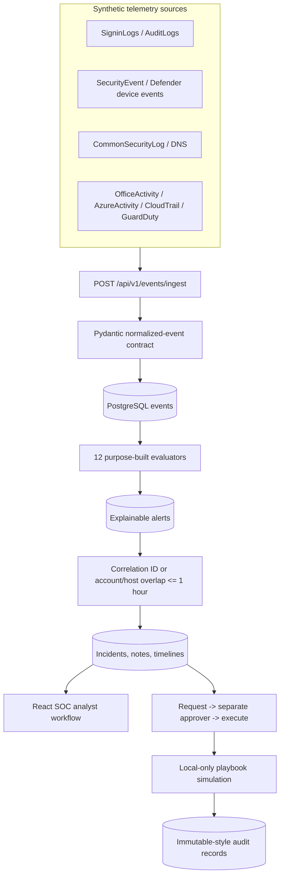

# Architecture and data flow

SentinelForge separates portable security content from local execution. KQL is the authoritative Microsoft Sentinel representation; Python evaluates a deliberately smaller normalized contract so every local outcome can be deterministic and testable.

## Component responsibilities

| Component | Responsibility | Deliberate boundary |
| --- | --- | --- |
| Generators | Repeatable benign and positive/negative scenario events | Cannot contact external systems |
| Normalized event model | Stable fields plus source-specific normalized properties | Rejects non-documentation public IP addresses |
| API | Ingestion, queries, incidents, hunts, quality, approval workflow | No authentication; local lab only |
| PostgreSQL | Container runtime persistence | SQLite is allowed only for native demos/tests |
| Detection loader | File-backed metadata, KQL, Sigma, fixtures | KQL content is read, never interpreted |
| Python evaluators | Narrow behavior equivalent for each selected rule | Not a complete KQL language engine |
| Correlator | Deterministic, explainable grouping | Not Defender XDR machine correlation |
| Dashboard | Live analyst views and working state transitions | No mocked production data or real containment |
| Local playbooks | Enrichment, recommendations, local status/audit | Separate approval; no real adapters |

## Event contract

Every event contains a timestamp, event source, host/device, user/identity, applicable source/destination IP, action/result, correlation ID, raw-event reference, and normalized source fields. The raw reference is an internal `synthetic://` URI; raw employer or customer payloads are neither required nor accepted.

## Correlation behavior

Alerts form connected components when either:

1. their synthetic correlation IDs are identical; or
2. they share an account or host and their observed windows are within one hour.

The incident summary lists its contributing rule IDs. This makes the result auditable and easy to tune, while avoiding claims of probabilistic or ML correlation.

## Local-to-Azure mapping

| Local implementation | Azure / Microsoft service |
| --- | --- |
| Event generator | Test ingestion or source simulator |
| Normalized Pydantic fields | ASIM schemas / Data Collection Rules transformations |
| PostgreSQL | Log Analytics workspace tables |
| KQL rule files | Microsoft Sentinel scheduled analytics rules |
| Python evaluator | Local test harness only |
| Alert/incident database | Sentinel and Defender XDR incidents |
| Dashboard overview/quality | Azure Workbooks and Sentinel analytics health |
| Threat Hunting Lab | Microsoft Sentinel Hunting queries |
| Approval-gated playbooks | Sentinel automation rules and Logic Apps |
| Local audit records | Sentinel/Logic Apps run history plus governance logs |

## Trust boundaries

- The dashboard and API are a single local trust zone and must not be exposed to untrusted networks.
- PostgreSQL is reachable only on the Compose network; it has no host port.
- The dashboard reverse proxies `/api` and adds defensive browser headers.
- Azure artifacts have no embedded identity, subscription, tenant, or credential.
- Logic Apps mappings remain `deployable: false` and explicitly list forbidden actions.

## Design decisions

The complete rationale, dependencies, risks, and milestone acceptance criteria are in [PLANS.md](../../PLANS.md). Operational commands are in the [runbook](../operations.md).
